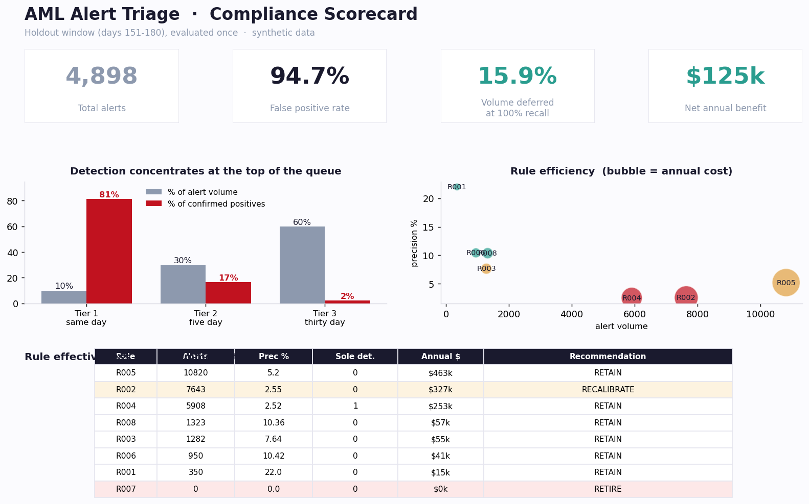
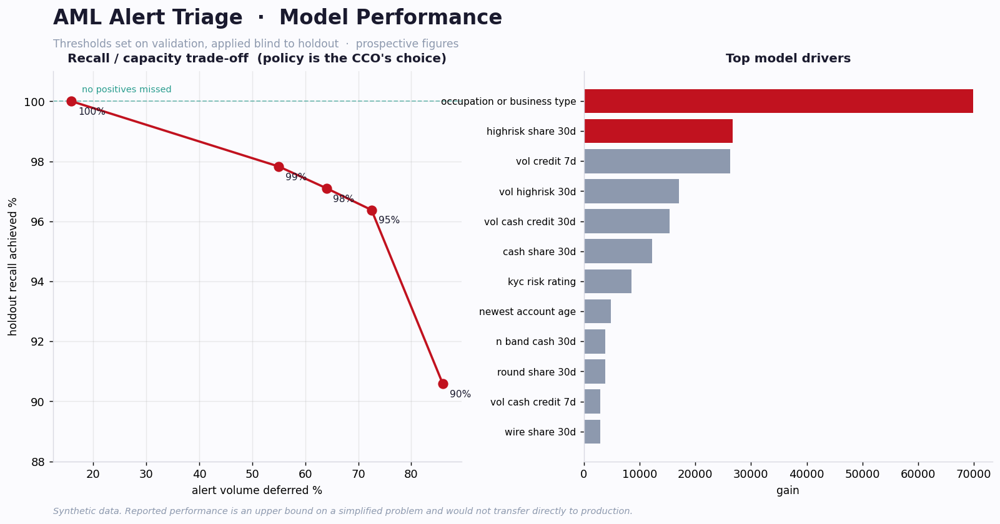

# AML Transaction Monitoring — Alert Triage Analytics

**Risk-based prioritisation of anti-money-laundering alerts. On a 30-day unseen
holdout, the model deferred 15.9% of alert volume with zero confirmed positives
missed, and concentrated 81% of confirmed positives into the top 10% of the
queue — an 8x lift over a 2.8% baseline.**

**Estimated net benefit $125,000/year, 3.9 month payback.** The rule-set analysis
separately identified one control that has never fired in 180 days and one
costing an estimated $327,000/year at 2.55% precision with no unique detection
coverage.

> ### ⚠️ Synthetic data
> **No real financial data was used in this project.** No real AML transaction
> data is public. All data is generated by `src/generate_data.py` from a fixed
> seed, with typologies modelled on FINTRAC's published guidance. Reported
> performance is an **upper bound on a simplified problem** and would not
> transfer directly to production. See
> [`docs/SYNTHETIC_DATA_ASSUMPTIONS.md`](docs/SYNTHETIC_DATA_ASSUMPTIONS.md).

**Stack:** SQL (window functions, star schema, data quality controls) · Python
(pandas, scikit-learn, LightGBM, SHAP) · Power BI (DAX, star model, RLS)




*Static previews rendered from the actual pipeline outputs (`src/make_previews.py`).
The interactive Power BI report is built from `powerbi/exports/` following
`powerbi/DASHBOARD_SPEC.md` — see the Power BI note below.*

---

## The problem

Rules-based transaction monitoring at Canadian banks generates alert volumes with
false positive rates commonly cited between 90% and 98%. Every false positive
consumes investigator hours. Every false negative is regulatory exposure under
the PCMLTFA. The question is whether alerts can be **prioritised** without losing
detection coverage.

The simulated book here reproduces that shape: **28,276 alerts** from 8 rules over
180 days across 4,000 customers, at a **94.7% false positive rate**.

## The operating policy, which constrains everything

**The model re-ranks alerts. It never auto-closes one.** Nothing is discarded.
Low-scoring alerts move to a longer service standard and lighter-touch review;
they are still worked. The benefit claimed is capacity *redirected*, not headcount
removed.

The threshold is chosen at 100% recall on a validation window and applied
**unchanged** to a later unseen holdout. Holdout recall is reported as measured.

---

## Results

Holdout window = days 151–180, evaluated once. 4,898 alerts, 138 confirmed
positives, 2.82% baseline precision.

### Tier concentration

| Tier | Share of volume | Share of confirmed positives | Precision |
|---|---|---|---|
| **Tier 1 — same day** | 10% | **81.2%** | 22.9% |
| Tier 2 — five days | 30% | 16.7% | 1.6% |
| Tier 3 — thirty days | 60% | 2.2% | 0.1% |

### Recall / capacity trade-off

Thresholds set on validation, applied blind to holdout. These are **prospective**
figures, not a curve fitted to the test set.

| Recall policy | Holdout recall achieved | Volume deferred | Precision in review |
|---|---|---|---|
| **100%** | **100.0%** | **15.9%** | 3.3% |
| 99% | 97.8% | 55.0% | 6.1% |
| 95% | 96.4% | 72.5% | 9.9% |
| 90% | 90.6% | 86.0% | 18.2% |

The step from 100% to 99% more than triples deferrable volume for ~2 points of
recall. Whether to take it is a compliance and regulatory decision, not an
analytical one — so it is priced, not recommended.

### Model selection

| Model | PR-AUC | ROC-AUC | Volume deferred at 100% recall |
|---|---|---|---|
| Random baseline | — | 0.50 | 0.0% |
| **Logistic regression (production)** | 0.516 | 0.951 | **15.9%** |
| LightGBM | 0.694 | 0.985 | 10.4% |

**The gradient boosted model wins on every aggregate metric and loses at the
operating point.** The 100%-recall constraint is set entirely by the
worst-ranked true positive, so overall ranking quality barely matters to it.
Selecting on AUC would have picked the wrong model. Logistic regression also
gives *exact* per-alert attribution rather than an approximation, which
materially simplifies model validation.

### Rule set findings

| Rule | Alerts | Precision | Sole detector for | Est. annual cost | Recommendation |
|---|---|---|---|---|---|
| R005 Velocity spike | 10,820 | 5.20% | 0 | $462,852 | Retain |
| R002 LCTR aggregation | 7,643 | 2.55% | 0 | $326,947 | **Recalibrate** |
| R004 High-risk wire | 5,908 | 2.52% | **1** | $252,735 | **Retain — sole detector** |
| R008 Sustained band cash | 1,323 | 10.36% | 0 | $56,595 | Retain |
| R003 Rapid movement | 1,282 | 7.64% | 0 | $54,845 | Retain |
| R006 Round-value cluster | 950 | 10.42% | 0 | $40,635 | Retain |
| R001 Near-threshold cash | 350 | 22.00% | 0 | $14,968 | Retain |
| **R007 Dormant reactivation** | **0** | — | 0 | $0 | **Retire — never fires** |

Two findings worth the whole analysis:

- **R007 has produced zero alerts in 180 days.** The control framework documents
  coverage of dormancy typologies that in practice does not exist.
- **R004 is an obvious efficiency target and must not be touched.** It runs at
  2.52% precision and costs $253k/year — but it is the *only* rule detecting one
  illicit customer. Precision alone would retire it and create a coverage gap.
  This distinction is why the recommendation is prioritisation, not rule removal.

---

## Architecture

```
generate_data.py          seeded synthetic generator, 3 behavioural layers
        |                 + deliberate data defects
        v
  SQLite warehouse        01_schema      star schema, declared grain
        |                 02_load_clean  dedup -> validate -> conform, quarantine
        |                 03_rules       8 rules on RANGE window frames
        |                 04_data_quality 13 controls, blocking failures abort
        v
   features.py            81 point-in-time features, 7/30/90d trailing windows
        v
  train_model.py          temporal split, prospective thresholds, bootstrap CIs
        |
        +-- explain.py        exact linear attribution -> per-alert reason codes
        +-- rule_analysis.py  effectiveness, overlap, sole-detector coverage
        +-- cost_benefit.py   business case + 27-row sensitivity
        v
  05_marts.sql -> powerbi/exports/*.csv -> Power BI star model
```

### Data quality controls

13 checks across reconciliation, uniqueness, referential integrity, validity and
completeness. **Blocking failures exit non-zero and stop the pipeline** — a
control framework that cannot stop the line is decoration.

Rejected rows are quarantined in `rejected_transaction` with reason and raw
payload, never silently dropped.

*During development `DQ01` caught a genuine off-by-one in my own loader: I was
validating before deduplicating, so one record was both loaded and quarantined.*

### SQL techniques

Rolling time windows use `RANGE BETWEEN n PRECEDING AND CURRENT ROW` over an
integer hour index — **not** `ROWS`. `ROWS` counts the previous N *records*
regardless of when they occurred, which is a different and wrong question. Also:
`LAG` for dormancy gaps, `ROW_NUMBER` for deduplication, correlated windowed
aggregates for pass-through detection.

---

## Reproducing

```bash
pip install -r requirements.txt
./run_all.sh          # ~4 minutes end to end
pytest -q             # 18 tests
```

Everything derives from `seed: 20260723` in `config/params.yml`. Every assumption
driving a headline number lives in that file, not scattered through the code.

### Power BI

This repo does **not** contain a `.pbix` — Power BI Desktop is Windows-only and
this was built on Linux. Provided instead:

- `powerbi/exports/*.csv` — the full star schema, 13.6 MB
- `powerbi/DASHBOARD_SPEC.md` — relationships, four pages, RLS, performance notes
- `powerbi/dax_measures.md` — every measure, written out

Four pages: **investigator queue** (default), compliance scorecard, model
performance, data quality scorecard.

*The investigator queue opens first by design. An earlier version led with the
executive scorecard; the primary user is an investigator with a queue to work at
9am, not an executive reviewing a monthly number.*

---

## Testing

18 tests, weighted toward correctness of the analytical claims rather than code
coverage. The three that matter:

- `test_no_lookahead_leakage` — inserts a huge transaction *after* an alert date
  and asserts the features for that alert are unchanged. A one-day window
  misalignment fails this.
- `test_ground_truth_never_in_features` — the label is structurally incapable of
  reaching the model.
- `test_reconciliation_balances` — staging = loaded + rejected + duplicates.

CI runs the full pipeline on every push. The warehouse build is itself a test:
it exits non-zero on any blocking DQ failure, so a cleaning regression fails the
build before pytest runs.

---

## What didn't work

[**`docs/WHAT_DIDNT_WORK.md`**](docs/WHAT_DIDNT_WORK.md) — read this one.

The first complete run scored **ROC-AUC 1.000**. The generator had applied its
legitimate-behaviour layer only to *non*-illicit customers, so the absence of
ordinary lawful activity — no rent, no remittances, no house purchase — was a
perfect predictor of the label. Fixing it dropped deferrable volume from 94% to
33%. Adding hard negatives dropped PR-AUC from 0.951 to 0.694.

Also documented: the trade-off curve that was an oracle result, a test I had
weakened into `assert True`, and why I stopped trying to make LightGBM win.

---

## Documentation

| | |
|---|---|
| [`docs/CCO_MEMO.md`](docs/CCO_MEMO.md) | One-page executive memo — the actual deliverable |
| [`docs/DATA_MODEL.md`](docs/DATA_MODEL.md) | Grain declarations, star schema, known simplifications |
| [`docs/SYNTHETIC_DATA_ASSUMPTIONS.md`](docs/SYNTHETIC_DATA_ASSUMPTIONS.md) | Every generator assumption and its rationale |
| [`docs/WHAT_DIDNT_WORK.md`](docs/WHAT_DIDNT_WORK.md) | Failures, dead ends, unresolved limitations |

## Limitations

Stated plainly because they bound every number above.

1. **Synthetic data.** Performance is an upper bound; real books are messier and
   real typologies adapt against detection.
2. **Labels are constructed ground truth**, not investigator dispositions. Real
   labels carry analyst inconsistency and survivorship bias.
3. **No model monitoring.** No drift detection, retraining trigger or rollback
   path. A prerequisite for production, not an enhancement.
4. **SCD Type 1 dimensions.** Alerts should be assessed against the KYC risk
   rating in force on the alert date, not today's.
5. **Bootstrap resamples alerts, not customers**, so intervals are narrower than
   a customer-level block bootstrap would give.
